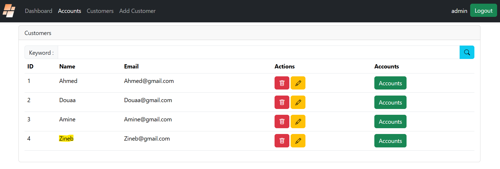
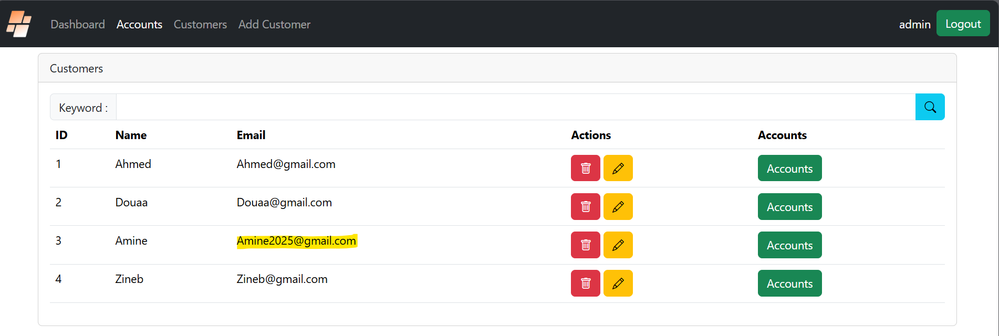
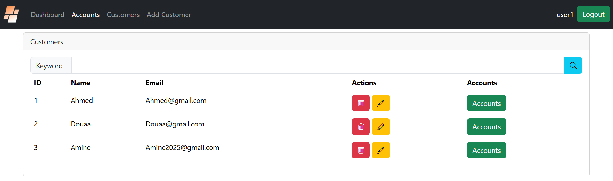

<h1>Projet JEE - Digital banking - Frontend</h1>

Une application de gestion de comptes bancaires où chaque client possède des comptes (courants ou épargnes) pouvant enregistrer des opérations de débit et crédit.

----

<h2>Authentification</h2>

<h2>Session Admin</h2>

<h2>Tableau de bord</h2>

<h2>Gestion des clients</h2>

<h3>Affichage des clients</h3>

<h3>Rechercher des clients par mot-clé</h3>

<h3>Ajout d'un client</h3>

<h3>Affichage du client ajouté</h3>

<h3>Consultation des comptes d'un client</h3>

<h3>Consultation des détails des opérations d'un client</h3>

<h3>Modification des données d'un client</h3>

<h3>Suppression d'un client</h3>

<h2>Gestion des opérations bancaires</h2>

<h2>Débit</h2>
<h3>Avant Débit</h3>

<h3>Après Débit</h3>

<h2>Crédit</h2>
<h3>Avant Crédit</h3>

<h3>Après  Crédit</h3>

<h2>Virements</h2>
<h3>Compte source - Avant Virement</h3>

<h3>Compte destination - Avant Virement</h3>

<h3>Compte source - Après Virement</h3>

<h3>Compte destination - Après Virement</h3>

<h2>Session Utilisateur</h2>

<h3>Affichage des clients</h3>

<h3>Consultation des comptes</h3>

<h3>Consultation des opérations bancaires triées par DEBIT</h3>

----

Auteur:
----
Realiseé par:  
RIZKI Mohamed Amine  
SERNANE Yahya  
EL MALKY Douaa  
AHCHOUCH Firdaws  
FATHEDDINE Zineb  
MALEK Jihane  
